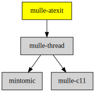

# mulle-atexit

#### 👼 Compatibility library to fix atexit

See [Challenges of shared library environments, Part 2](//www.mulle-kybernetik.com/weblog/2019/atexit_is_broken.html), why and when this is necessary to use.

This reimplements `atexit` as it should be, just under a different name.

| Release Version
|-----------------------------------
|  [](//github.com/mulle-core/mulle-atexit/actions)


You must **statically** link the mulle-atexit library with your executable.
Ensure that global symbols are exported and that the whole library is linked
to the executable and not optimized away by the linker.

Platform | Linker Flags
---------|--------------------------------------------------
Linux    | `-Wl,--export-dynamic -Wl,--whole-archive`
macos    | -force_load <library>


## Add

Use [mulle-sde](//github.com/mulle-sde) to add mulle-atexit to your project:

``` sh
mulle-sde dependency add --c \
                         --github mulle-core \
                         --marks no-dynamic-link,no-intermediate-link,no-singlephase,all-load \
                         mulle-atexit
```


### You are here




## Install

### mulle-sde

Use [mulle-sde](//github.com/mulle-sde) to build and install mulle-atexit and all dependencies:

``` sh
mulle-sde install --prefix /usr/local \
   //github.com/mulle-core/mulle-atexit/archive/latest.tar.gz
```

### Manual Installation


Install the requirements:

Requirements                                               | Description
-----------------------------------------------------------|-----------------------
[mulle-thread](//github.com/mulle-concurrent/mulle-thread) | Threads and atomics


Install into `/usr/local`:

``` sh
mkdir build 2> /dev/null
(
   cd build ;
   cmake -DCMAKE_INSTALL_PREFIX=/usr/local \
         -DCMAKE_PREFIX_PATH=/usr/local \
         -DCMAKE_BUILD_TYPE=Release .. ;
   make install
)
```


